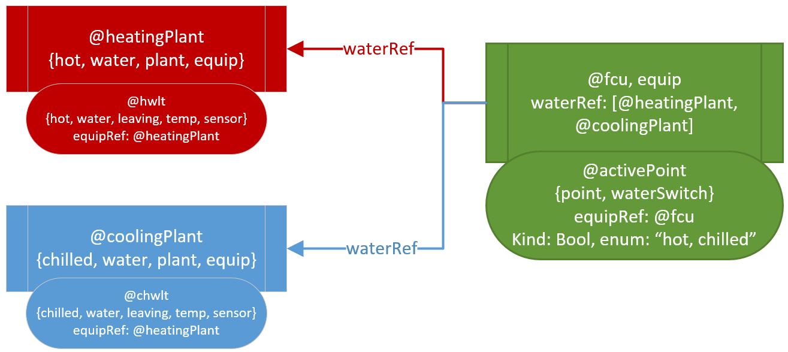

# Application Note: Multi-Ref Structure & Active State

## Overview

This application note addresses two problems:

- how to model entities that `ref` multiple entities for the same purpose
- how to read historical data based on that model structure

This note does not introduce any new concepts to the ontology, but rather suggests how to use existing concepts to address a particular edge case.

## Problem Examples

We'll detail a general solution to the problem, and then apply it to these examples (explained in greater detail as we build them out).

1. A two-pipe `fcu-equip` can be both `heating` or `cooling` depending on the `plant-mode` in the building.
2. An automatic transfer switch has an `elecRef` to both an emergency `generator` and a normal primary `elec-circuit`. The currently active `elec` source depends on the position of the ATS.
3. *Suggestions?*

## Solution Structure

In the abstract case, we want to observe the `active` state of an `equip`, based on some external mode or condition. The recommended solution is to:

1. Point to reference entities via `fooRef`
2. Model the state information locally with a child `foo-his-point` entity
3. Tag entities `fooRef` points to with identifying markers, e.g., `heating` & `cooling` or `
4. Tag the child point with `fooSwitch` indicating that this point will dictate the active referant over time.

## Applied to Examples

Ihe `fcu` example, imagine we have the following:

    @fcu
    equip
    heating
    cooling
    waterRef: [@heatingPlant, @coolingPlant]
    ---
    @point
    equipRef: @fcu
    his
    waterSwitch
    kind: Bool
    enum: "hot, chilled"
    ---
    @heatingPlant
    hot
    water
    plant
    equip
    ---
    @coolingPlant
    chilled
    water
    plant
    equip
    ---

Our desire is to see the active "water ref state" based upon time-series data. Using this model, we could implement the following Axon function:

    findActiveRef(Dict equip, Str marker, DateSpan range) => do
      //e.g. "water" + "Switch"
      switchTag: parseTag(marker.toStr + "Switch")
      switchPt: equip.toPoints.find(p=> p.has(switchTag))
      switchHisData: switchPt.hisRead(range)
      
      //"heating", "cooling"
      states: switchPt["enum"]
      
      //"water" + "Ref" -> @heatingPlant & @coolingPlant
      refEntities: equip[marker + "Ref"]
      
      //add a column to history data mapping the value of switchPoint,
      //"heating" or "cooling" to the id of the respective equip
      return switchHisData.addCol("activeRef", c=> refEntities.find(r=> r.has(c->v0)->id))
    end

The last line of this function could be modified or extended in any number of ways to modify the original history data, or other historical data from the `fcu`. For instance, in an analytics application, we can map the active `waterRef` entity to determine if the `fcu` has proper incoming water for control:

    //map the active leaving water temp into the history data
    findActiveWaterTemp(equip, switchTag, range) => do
      //####
      switchTag: parseTag(marker.toStr + "Switch")
      switchPt: equip.toPoints.find(p=> p.has(switchTag))
      switchHisData: switchPt.hisRead(range)
      states: switchPt["enum"]
      refEntities: equip[marker + "Ref"]
      switchHisData: switchHisData.addCol("activeRef", c=> refEntities.find(r=> r.has(c->v0)->id))
      //####
      lwtFilter: "point and his and leaving and water and temp and sensor"
      leavingWaterTemps: refEntities.map(e=> e.toPoints.find(filterToFunc(parseFilter(lwtFilter)))).hisRead(range)
      //## To - do
      //use state data to compute sliding windows
      //slice temperature data along sliding windows into original history grid
    end