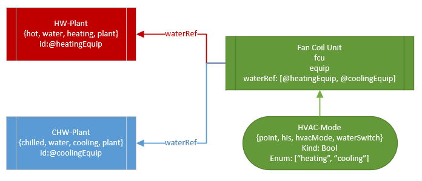
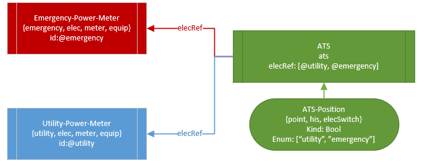
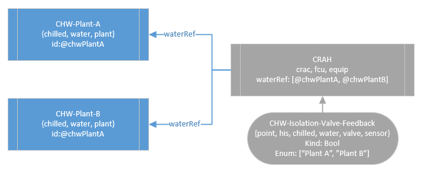

## Example Structure & Implementation Options

The goal is to take point the point structure below, and map the hvacMode data point from state data about the system to historized ref data about the active source of some medium. In this case, the active medium is a type of water, but it could also be electricity, or multiple sources for the same kind of water, etc.

    id:@fcu
    fcu
    equip
    waterRef: [@hotWaterPlant,@chilledWaterPlant]
    ---
    id:@hvacMode
    point
    hvacMode
    equipRef: @fcu
    waterSwitch
    kind: Number
    enum: ["heating","cooling"]
    ---
    id:@hotWaterPlant
    hot
    water
    plant
    equip
    heating
    ---
    id:@chilledWaterPlant
    chilled
    water
    plant
    equip
    cooling

### Option 1: `enum` ordinal equates to `fooRef` ordinal

`curVal` of `hvac-mode-point` is a Number or Bool which is translated to some enum value. 
The literal number value (0, 1, 2, ... or false/true) translates to the ordinal in the parent equip's `waterRef` list.
E.g., 0 or false == `@hotWaterPlant` and 1 or true == `@chilledWaterPlant`

Sample version of `findActiveRef(equip, marker, range)`:

    (equip, marker, range) => do
      //e.g. "water" + "Switch"
      switchTag: toTagName(marker + "Switch")
      switchPt: equip.toPoints.find(p=> p.has(switchTag))
      switchHisData: switchPt.hisRead(range)

      switchKind: switchPt->kind
      
      //"water" + "Ref"
      refEntities: equip[marker + "Ref"]
      
      //add a column to history data mapping the value of switchPoint
      //do check for boolean data, false == 0 & true == 1
      //if we have numeric data, pass the ordinal lookup
      return switchHisData.addCol("activeRef", c=> do
        if(switchKind == "Bool")
          if(c["v0"]) refEntities[1]
          else refEntities[0]
        else if(switchKind == "Number")
          refEntities[c["v0"]]
      end)
    end

Advantages:

- The enum text display can remain for human readable purposes only, and does not affect the tooling
- Easier to incorporate multiple references of the same "kind" e.g. a CRAH unit that could be fed from a Primary or Secondary Chilled Water Plant.

Disadvantages:

- `waterRef` list and `hvac-mode-point` values are tightly coupled. Integrators would have to define `waterRef` after discovering behavior of an existing `hvac-mode-point` if it comes from a communicating stat, or implement custom functions to prescribe exact values of the `hvac-mode-point` to remove conflicts.

### Option 2: text value of `enum` ordinal provides a lookup tag at `fooRef` pointer

*This is what's implemented in the demo `playground` database*

In this case, the active text value of the `enum` on the `hvac-mode-point` would be coerced to a marker tag; e.g.,`toTagName("heating")` in Haxall.

Sample version of `findActiveRef(equip, marker, range)`:

    (equip, marker, range) => do
      //e.g. "water" + "Switch"
      switchTag: toTagName(marker + "Switch")
      switchPt: equip.toPoints.find(p=> p.has(switchTag))
      switchHisData: switchPt.hisRead(range)
      
      //"heating", "cooling"
      states: switchPt["enum"].split(",")
      
      //"water" + "Ref"
      refEntities: equip[marker + "Ref"]
      
      //add a column to history data mapping the value of switchPoint,
      return switchHisData.addCol("activeRef", c=> do
        //this line grabs either states[1] == "cooling" or states[0] == "heating"
        if(c["v0"]) val: states[1] else val: states[0]

        //now we look at the list of `waterRef` entities and ask which one `.has` the
        //selected marker tag
        refEntities.find(r=> r.toRec().has(val))->id
      end)
    end

Advantages:

- Integrator can explicitly state what draws the relationship lines from one source or another
- Enum tagset list order and fooRef order no longer matters, it's driven by the value of what's in the list.

Disadvantages:

- Can be problematic to reference multiple items of the same `type` and require additional qualifier tags, e.g., `primary` vs. `secondary` chilled water plants.
- `waterRef` list and `hvac-mode-point` values are tightly coupled. Integrators would have to define `waterRef` after discovering behavior of an existing `hvac-mode-point` if it comes from a communicating stat, or implement custom functions to prescribe exact values of the `hvac-mode-point` to remove conflicts.

## Further notes

I plan to build out working samples of the following in SkySpark to demonstrate at Haystack Connect (and later post as the application note). Each example would be accompanied with the "thing to solve" and one example "use case" for that solution:

- 2-Pipe FCU in Heating & Cooling Mode
  - Solve for: HVAC Mode relationship with Active Plant
  - Use case: Active coil entering water temperature (in lieu of a local sensor)
- Automatic Transfer Switch in Normal or Emergency Mode
  - Solve for: Active elec source depending on ATS Position
  - Use case: Determine incoming power being provided to switch
- CRAC Unit with Multiple Chilled Water Sources
  - Solve for: Isolation Valve position mapped to which Plant is actively feeding the CRAC
  - Use case: Active coil entering water temperature
- Other...? Perhaps something that is a different kind of edge case, like multi-tiered systems or a Chilled/Condenser Water Swing Pump?

## Diagrams

### 2-Pipe FCU

### ATS Mode

### CRAH with Multiple Sources

